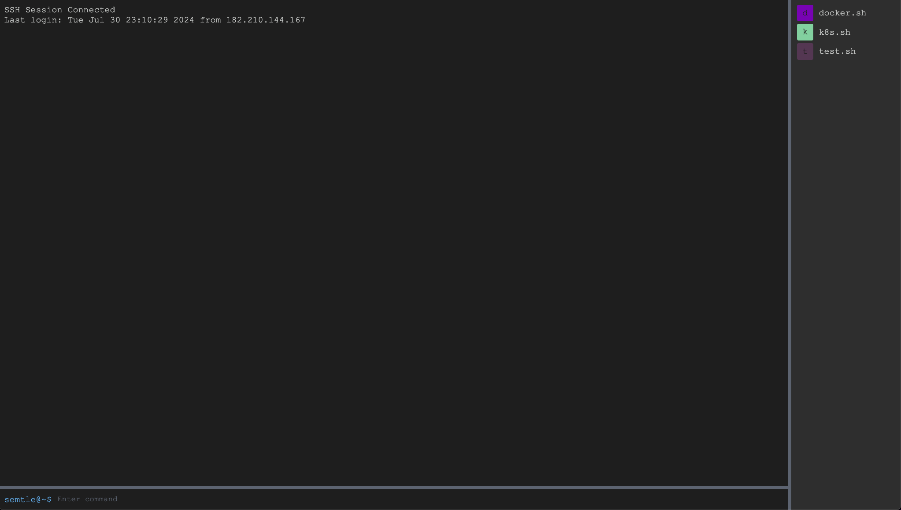

```  
_                   _          ___  ___  _ _
| |_  ___  _ _  ___ | |__ ___  / __>/ __>| | |
| . \<_> || '_>/ . \| / /<_> | \__ \\__ \|   |
|___/<___||_|  \___/|_\_\<___| <___/<___/|_|_|
```
---
## Web기반 SSH / Tunnel SSH 바로가! ↗️
# 

매번 SSH 접속 및 터널링 복사/붙여녛기로 진행하셨던 분들 주목! (바로 나)

### Baroka 장점
* **한번 접속한 SSH를 기억해논 후 다음 번에 클릭만으로 접속**
* **Terminal(Iterm)에서 사용하던 단축 키 그대로!**
  * <span style="color:#00A6FFFF"> Tab </span>(자동완성)
  * <span style="color:#00A6FFFF"> Ctrl + C  </span>(중지)
  * **<span style="color:#00A6FFFF"> script </span> 파일 등록 및 아이콘 실행**
  * **<span style="color:#00A6FFFF"> VI </span> 편집기를 쉽고 간편하게**

자주 쓰는 명령어를 bashShell 로 저장해 GUI와 유사하게 손 쉽게 명령을 입력할 수 있습니다.

<span style="color:red"> 로컬 환경 </span>에서만의 사용을 필히 권장드리며, Docker Volume을 마운팅해서 데이터를 기억해놓으세요!

# <span style="background-color:#fff5b1; color:#000;"> How to use baroka </span>
### **Docker Build**
```shell
git clone https://github.com/Darren4641/baroka.git
cd baroka

docker-compose up -d
```
### **1. http://localhost:8080 접속**
### **2. [+] 버튼을 눌러 서버를 추가하세요.**
# 
### **3. SSH 접속 유형을 선택해주세요.**
# 
### **단순 SSH의 경우**
```
[example]
ssh -i temp.pem ec2-user@10.x.x.x -P 22

ID - Title 입력(원하는 이름)   
사용자명 - ec2-user  
호스트 - 10.x.x.x
포트 - 22   
PEM - temp.pem
```
### **SSH 터널링의 경우**
```
[example]
ssh -i bastion.pem -L 2251:10.x.x.x:22 ec2-user@bastion-public-ip -p 22
ssh -i ec2.pem ec2-user@127.0.0.1 -p 2251

ID - Title 입력(원하는 이름)   
터널링 호스트 - bastion-public-ip(ex: x.x.x.x)
터널링 포트 - bastion-ssh-port(ex: 22)
터널링 사용자명 - ec2-user
터널링 접속에 필요한 인증 방식 - bastion.pem
로컬 포트 - 2251
원격 호스트 - 10.x.x.x
원격 포트 - 22
목적지 서버 사용자명 - ec2-user
목적지 주소 인증 방식 - ec2.pem 
```
### **4. 연결 클릭**
### **5. 접속 후 기존 Terminal과 동일하게 입력**
# 

### **6. VI 편집기 실행 (명령어로)**
```shell
vi test
```
# 
저장 후 나가기 클릭시 명령어를 입력한 경로에 파일 저장

### **7. 바로카 스크립트 생성**
### 1.버튼 클릭 

### 2. 스크립트 제목 / 스크립트 내용 작성 후 저장


### 3-1. 아이콘 클릭시 스크립트 실행
### 3-2. 이름 클릭 시 편집
### 3-3. X아이콘 클릭시 삭제


